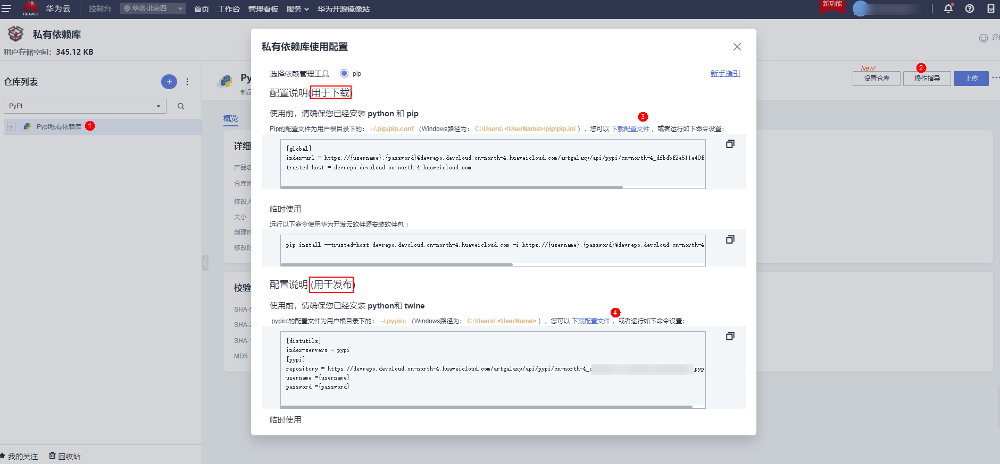

# PyPI CloudArtifact Action
  
私有依赖库(CloudArtifact)是发布服务（[CloudRelease](https://support.huaweicloud.com/cloudrelease/index.html)）的语言软件仓库功能。用于管理私有组件（开发者通俗称之为私服），包括Maven、Npm、Go、PyPI、Rpm等多种仓库格式。   
使用华为云CloudArtifact PyPI 私仓有如下场景：  
1.twine upload: 推送PyPI组件到 CloudArtifact PyPI 私仓   
2.pip install: 拉取CloudArtifact PyPI 私仓的PyPI组件

## 前置工作
(1) [新建私有依赖库](https://support.huaweicloud.com/usermanual-releaseman/cloudrelease_01_0008.html)  
(2) [仓库权限](https://support.huaweicloud.com/usermanual-releaseman/cloudrelease_01_0011.html)  
上传PyPI组件需要权限: 仓库角色为仓库管理员、开发者  
下载PyPI组件需要权限: 仓库角色为仓库管理员、开发者、浏览者  
> 不是仓库成员或者没有对应权限需要租户帐号、仓库管理员修改为对应的仓库角色。

(3) CloudArtifact PyPI 私仓上传下载账号信息获取  
[私有依赖库首页](https://devcloud.cn-north-4.huaweicloud.com/cloudartifact/repository)->点击需要的PyPI仓库->右上角操作指导->点击下载配置文件->根据上传或者下载场景，下载对应的配置文件  


## 参数说明
### 1.首先需要了解PyPI配置文件：  

1.PyPI 上传配置文件 ~/.pypirc
```
[distutils]
index-servers = pypi

[pypi]
repository = <repository URL>
username = <repository username>
password = <repository password>
```
> Reference: [.pypirc file](https://packaging.python.org/en/latest/specifications/pypirc/)  

2.PyPI 下载配置文件 ~/.pip/pip.conf （Windows路径为： C:\Users\\`<UserName>`\pip\pip.ini ）
```
[global]
index-url = <repository URL with authentication>
trusted-host = <repository host>
```
> Reference: [pip config file](https://pip.pypa.io/en/stable/topics/configuration/)   

### 2.action参数与PyPI配置文件的内容对应关系
| Name          | Require | Default | Description |
| ------------- | ------- | ------- | ----------- |
| pypi-operation-type    |   true    |   install      | PyPI私仓使用场景：install/upload。install即是拉取CloudArtifact PyPI 私仓的PyPI组件；upload即是推送PyPI组件到 CloudArtifact PyPI 私仓|
| index-url    |   false    |   https://pypi.org/simple      | pip.conf文件中index-url的内容|
| trusted-host    |   false    |   pypi.org      | pip.conf文件中trusted-host的内容|
| repository    |   false    |    https://pypi.org/simple      | .pypirc文件中repository的内容|
| username    |   false    |         | .pypirc文件中username的内容,建议在github项目的SettingS--Secret--Actions下添加 PyPI_USERNAME参数|
| password    |   false    |         | .pypirc文件中password的内容,建议在github项目的Settings--Secret--Actions下添加 PyPI_PASSWORD参数|
| index-server    |   false    |   pypi      | .pypirc文件中index-server的内容|

具体可以看下面图中action参数对应的PyPI配置文件的内容


## **CloudArtifact PyPI 私仓workflows样例**
### 1.twine upload: 推送PyPI package到 CloudArtifact PyPI 私仓 
步骤说明：  
(1)代码检出   
(2)设置python版本  
(3)华为云CloudArtifact PyPI 私仓配置    
(4)twine upload 推送PyPI package到 CloudArtifact PyPI 私仓  
```yaml
name: PyPI Cloudartifact Action Publish Demo
on:
  push:
    branches:
       master
jobs:
  Publish-to-CloudArtifact-PyPI:
    runs-on: ubuntu-latest
    steps:
        # 代码检出
      - uses: actions/checkout@v2

        # GitHub Action环境默认python版本为3.8.X，可以根据自己项目需求修改python版本
      - name: Setup Python
        uses: actions/setup-python@v4
        with:
          python-version: 3.8

        # 华为云CloudArtifact PyPI 私仓配置 
      - name: Setup Huawei Cloud PyPI CloudArtifact
        uses: huaweicloud/PyPI-cloudartifact-action@v1.0.0
        with: 
          pypi-operation-type: upload
          repository: '<repository URL>'
          username: ${{ secrets.PyPI_USERNAME }}
          password: ${{ secrets.PyPI_PASSWORD }}

        # 打包的我们的库/项目
      - name: Packaged Our Libraries/Projects
        run: |
          python -m build
            
        # 使用twine将打包好的库/项目上传到华为云CloudArtifact PyPI 私仓
      - name: Publish PyPI package 
        run: |
          twine upload -r pypi dist/*
```  
### 2.pip install: 拉取CloudArtifact PyPI 私仓的PyPI组件  
步骤说明：  
(1)代码检出  
(2)设置python版本  
(3)华为云CloudArtifact PyPI 私仓配置    
(4)pip install 拉取CloudArtifact PyPI 私仓的PyPI package  
```yaml
name: PyPI Cloudartifact Action Install Demo
on:
  push:
    branches:
       master
jobs:
  Install-from-CloudArtifact-PyPI:
    runs-on: ubuntu-latest
    steps:
        # 代码检出
      - uses: actions/checkout@v2

        # GitHub Action环境默认python版本为3.8.X，可以根据自己项目需求修改python版本
      - name: Setup Python
        uses: actions/setup-python@v4
        with:
          python-version: 3.8

        # 华为云CloudArtifact PyPI 私仓配置 
        # action的index-url可以这样设置：https://${{ secrets.PyPI_AUTH }}@devrepo.devcloud.cn-north-4.huaweicloud.com/artgalaxy/api/pypi/cn-north-4_dfbdbf2e511e**********653358d65c_pypi_0/simple
        # ${{ secrets.PyPI_AUTH }}的内容是：从华为云私有库获取PyPI的index-url中的{username}:{password}
      - name: Setup Huawei Cloud PyPI CloudArtifact
        uses: huaweicloud/PyPI-cloudartifact-action@v1.0.0
        with: 
          pypi-operation-type: install
          index-url: '<repository URL with authentication>'
          trusted-host: '<repository URL host>'

        # 拉取CloudArtifact PyPI 私仓的PyPI package
      - name: Install PyPI package 
        run: |
          pip install <PyPI name>
```   


详情可参考 [PyPI-cloudartifact-workflow-samples](https://github.com/huaweicloud/PyPI-cloudartifact-workflow-samples)

## 公网域名说明
```
PyPI官方镜像源：'https://pypi.org/simple'
```
